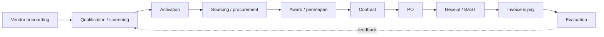
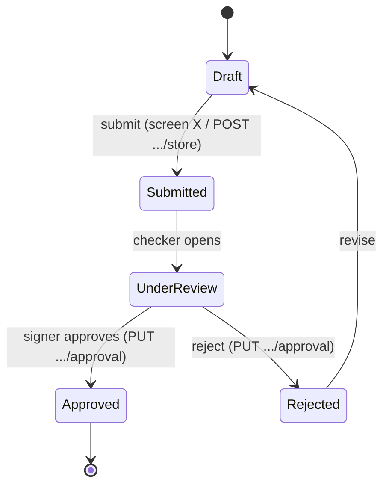
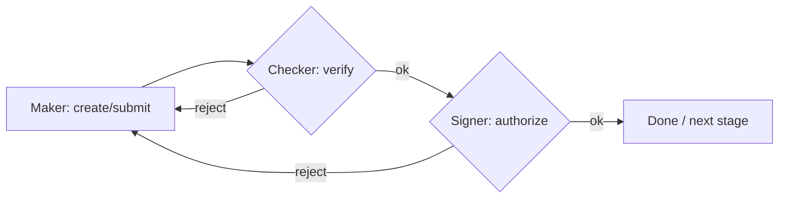

# Mermaid templates for FLOW.md

Copy, then replace placeholders with evidence-backed nodes/edges. Keep labels short.

## 1. Source-to-pay pipeline (top of doc)

Delete stages the repo does not implement; keep the arrows honest.

## 2. Per-entity state machine

Every edge label = trigger (screen or endpoint). States come from the status constant set.

## 3. Approval chain (maker–checker–signer)

Annotate each node with the endpoint / approver-type constant that governs it.

## Rendering note

GitHub renders mermaid in .md natively. If the user needs a static image, offer to
export via an Artifact or a local mermaid-cli step — don't assume it.
